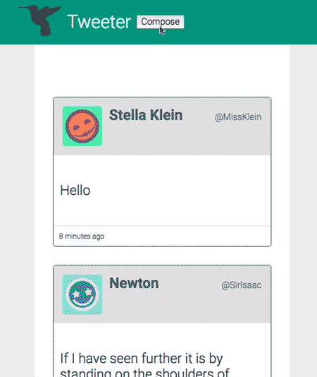

# <code>Tweeter</code> Project

Tweeter is a simple, single-page Twitter clone.

## Final Product

Composing a Tweet

## Getting Started

1. Fork this repository, then clone your fork of this repository.
2. Install dependencies using the `npm install` command.
3. Start the web server using the `npm run local` command. The app will be served at <http://localhost:8080/>.
4. Go to <http://localhost:8080/> in your browser.

## Dependencies

- Express
- body-parser
- Chance
- MongoDB
- Node 5.10.x or above
- MD5
- Moment.js

## Getting Started

- Install all depencies using `npm install` command
- Run the development web server using the `npm run local` command. The app will be served at <http://localhost:8080/>.
- Go to <http://localhost:8080/> in your browser.

## Functional Requirements

<ul>
<li> ✅ Primarily a client-side Single Page App (SPA)</li>
<li> ✅ The client-side app communicates with a server via AJAX</li>
<li> ✅ Tweets are persisted to MongoDB and survive server restart</li>
</ul>

## Display Requirements

<ul>
<li>
Navigation Bar:

<ul>
<li> ✅ is fixed to the top</li>
<li> ✅ has padding on both sides</li>
<li> ✅ contains Compose button</li>
</ul></li>
<li>
Compose Tweet box:

<ul>
<li> ✅ is displayed above the list of tweets</li>
<li> ✅ contains a form for submitting tweets, which itself contains:

<ul>
<li> ✅ a <code>textarea</code> for new tweet content</li>
<li> ✅ a left-aligned button for submitting new tweets</li>
</ul></li>
<li> ✅ contains a Character Counter, right-aligned, which by default shows 140</li>
</ul></li>
<li>
List of Tweets:

<ul>
<li> ✅ displays tweets in reverse-chronological order (that is, by creation time descending)</li>
</ul></li>
<li>
Individual Tweets:

<ul>
<li> ✅ have a header, which contains the user's:

<ul>
<li> ✅ avatar, on the left</li>
<li> ✅ name, on the left and after the avatar</li>
<li> ✅ handle, on the right</li>
</ul></li>
<li> ✅ have a body, which contains the tweet text</li>
<li> ✅ have a footer, which displays:

<ul>
<li> ✅ how long ago the tweet was created, on the left</li>
<li> ✅ "Flag", "Re-tweet" and "Like" icons upon hovering over the tweet, on the right</li>
</ul></li>
</ul></li>
</ul>

## Behaviour

<h4>Navigation Bar</h4>

<ul>
<li>When a user clicks the Compose button in the Navigation Bar:

<ul>
<li> ✅ if the Compose Tweet box is currently hidden, then it is shown, and the <code>textarea</code> inside it is auto-focused</li>
<li> ✅ if the Compose Tweet box is currently showing, then it is hidden</li>
<li> ✅ in either case, transitions between 'shown' and 'hidden' states should be animated</li>
</ul></li>
</ul>

<h4>Character Counter</h4>

<ul>
<li>
 ✅ When a user types into the Compose Tweet <code>textarea</code>, the Character Counter is updated to show how many characters a user may still type (subtracting the number of characters they've typed from the maximum allowable character count of 140)
</li>
<li>
 ✅ The Character Counter turns red (or similar) when more than 140 characters have been typed into the Compose Tweet <code>textarea</code>, and it shows how many characters over the 140 limit have been typed (using a negative number)
</li>
</ul>

<h4>Compose Tweet</h4>

<ul>
<li>
 ✅ When a user submits an invalid tweet (the tweet <code>textarea</code> is empty or contains more than 140 characters), an appropriate error message is displayed
</li>
<li>
 ✅ When a user submits a valid tweet, the list of tweets is refreshed (displaying the new tweet), the Compose Tweet <code>textarea</code> is cleared, and the Character Counter is reset (to 140)
</li>
</ul>

<h4>Stretch</h4>

<ul>
<li>
When a user clicks a tweet's "Like" button, the "Like" count is updated
</li>
<li>
Only logged-in users may "like" tweets, and they may not "like" their own tweets
</li>
</ul>

